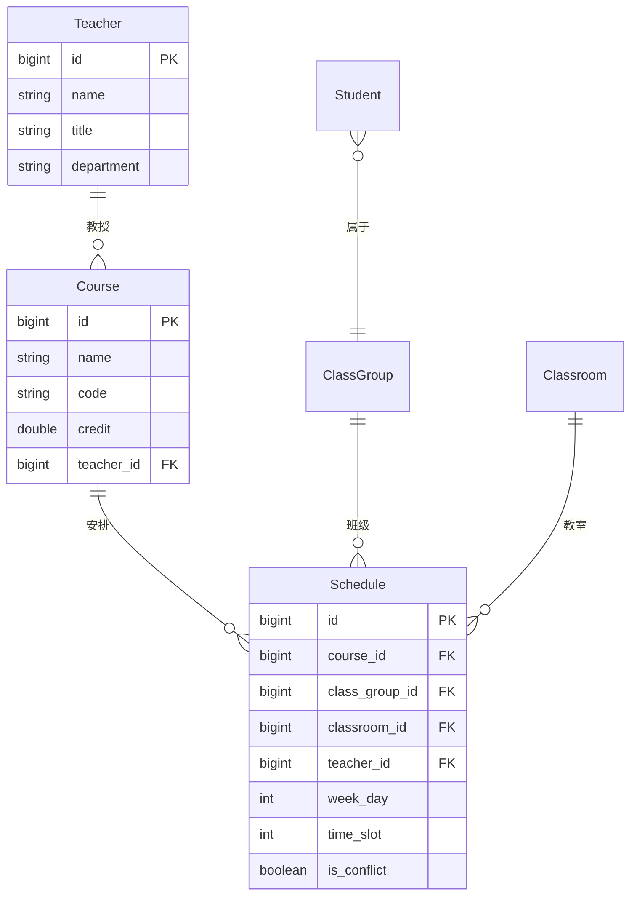

# 开发指南

## 项目架构

### 后端架构
```
com.wj.aischedule
├── entity/              # JPA实体类
│   ├── AdminUser.java  # 管理员
│   ├── Student.java    # 学生
│   ├── Teacher.java    # 教师
│   ├── Course.java     # 课程
│   ├── Classroom.java  # 教室
│   ├── ClassGroup.java # 班级
│   └── Schedule.java   # 排课安排
│
├── repository/          # 数据访问层
│   └── *Repository.java # Spring Data JPA接口
│
├── service/             # 业务逻辑层
│   ├── *Service.java    # 业务服务
│   └── SchedulingService.java # 智能排课核心服务
│
├── controller/          # 控制层
│   └── *Controller.java # REST API控制器
│
└── optaplanner/         # AI优化模块
    ├── domain/          # 域模型
    │   ├── Timeslot.java
    │   ├── Room.java
    │   ├── Lesson.java
    │   └── TimeTable.java
    └── solver/          # 约束规则
        └── TimeTableConstraintProvider.java
```

### 前端架构
```
src/
├── api/                 # API接口封装
│   ├── admin.js
│   ├── student.js
│   ├── teacher.js
│   ├── course.js
│   └── scheduling.js
│
├── router/              # 路由配置
│   └── index.js
│
├── store/               # 状态管理
│   ├── index.js
│   └── user.js
│
├── utils/               # 工具函数
│   └── request.js       # axios封装
│
└── views/               # 页面组件
    ├── admin/           # 管理页面
    │   ├── Dashboard.vue
    │   ├── Students.vue
    │   ├── Teachers.vue
    │   ├── Courses.vue
    │   └── Scheduling.vue
    └── login/           # 登录页面
        └── AdminLogin.vue
```

## 开发规范

### 代码规范
1. **命名规范**
   - 类名：大驼峰，如 `StudentController`
   - 方法名：小驼峰，如 `getStudentById`
   - 变量名：小驼峰，如 `studentName`
   - 常量：全大写，下划线分隔，如 `MAX_STUDENT_COUNT`

2. **注释规范**
   - 类注释：说明类的作用
   - 方法注释：说明方法功能、参数、返回值
   - 复杂逻辑注释：说明算法思路

3. **API设计**
   - RESTful风格
   - 统一响应格式
   - 合理的HTTP状态码

### Git提交规范
```
feat: 新增功能
fix: 修复bug
docs: 文档更新
style: 代码格式调整
refactor: 代码重构
test: 测试相关
chore: 构建过程或辅助工具变动
```

## 数据库设计

### 核心表关系


### 索引优化
- 频繁查询字段建立索引
- 联合查询建立复合索引
- 外键字段自动建立索引

## 智能排课算法

### 约束定义
在 `TimeTableConstraintProvider.java` 中定义约束：

```java
// 硬约束示例
private Constraint roomCapacity(ConstraintFactory constraintFactory) {
    return constraintFactory.forEach(Lesson.class)
            .filter(lesson -> lesson.getRoom() != null && 
                    lesson.getStudentCount() > lesson.getRoom().getCapacity())
            .penalize(HardSoftScore.ONE_HARD,
                    lesson -> lesson.getStudentCount() - lesson.getRoom().getCapacity())
            .asConstraint("教室容量不足");
}

// 软约束示例
private Constraint teacherTimePreference(ConstraintFactory constraintFactory) {
    return constraintFactory.forEach(Lesson.class)
            .filter(lesson -> lesson.getTimeslot() != null)
            .filter(lesson -> lesson.getTimeslot().getStartTime().getHour() >= 14)
            .penalize(HardSoftScore.ONE_SOFT)
            .asConstraint("教师时间偏好");
}
```

### 算法配置
在 `solverConfig.xml` 中配置：

```xml
<termination>
    <secondsSpentLimit>30</secondsSpentLimit>
    <stepCountLimit>5000</stepCountLimit>
</termination>

<constructionHeuristic>
    <constructionHeuristicType>FIRST_FIT_DECREASING</constructionHeuristicType>
</constructionHeuristic>

<localSearch>
    <unionMoveSelector>
        <changeMoveSelector/>
        <swapMoveSelector/>
    </unionMoveSelector>
</localSearch>
```

## 前端开发

### 组件开发规范
1. **单文件组件结构**
```vue
<template>
  <!-- 模板 -->
</template>

<script setup>
// 逻辑
</script>

<style scoped>
/* 样式 */
</style>
```

2. **API调用**
```javascript
import courseApi from '@/api/course.js'

const getCourses = async () => {
  try {
    const response = await courseApi.getCourses()
    if (response.code === 200) {
      courses.value = response.data
    }
  } catch (error) {
    ElMessage.error('获取失败')
  }
}
```

3. **状态管理**
```javascript
import { useUserStore } from '@/store/user'

const userStore = useUserStore()
const isLoggedIn = computed(() => !!userStore.token)
```

### 样式规范
- 使用Element Plus组件库
- 自定义样式使用scoped
- 响应式设计
- 统一的颜色和字体

## 测试

### 单元测试
```java
@SpringBootTest
class SchedulingServiceTest {
    
    @Autowired
    private SchedulingService schedulingService;
    
    @Test
    void testGenerateTestData() {
        TimeTable timeTable = schedulingService.generateTestData();
        assertNotNull(timeTable);
        assertTrue(timeTable.getLessonList().size() > 0);
    }
}
```

### 集成测试
```java
@AutoConfigureMockMvc
@SpringBootTest
class SchedulingControllerTest {
    
    @Autowired
    private MockMvc mockMvc;
    
    @Test
    void testAutoSchedule() throws Exception {
        mockMvc.perform(post("/api/scheduling/auto-schedule"))
                .andExpect(status().isOk())
                .andExpect(jsonPath("$.code").value(200));
    }
}
```

### 前端测试
```javascript
// 组件测试示例
import { mount } from '@vue/test-utils'
import Scheduling from '@/views/admin/Scheduling.vue'

describe('Scheduling.vue', () => {
  it('渲染正确', () => {
    const wrapper = mount(Scheduling)
    expect(wrapper.find('.scheduling-container').exists()).toBe(true)
  })
})
```

## 部署

### 后端部署
1. 打包：`mvn clean package`
2. 运行：`java -jar target/aischedule-0.0.1-SNAPSHOT.jar`
3. 配置：`application-prod.yml`

### 前端部署
1. 构建：`npm run build`
2. 部署到Nginx或静态服务器
3. 配置API代理

### 数据库部署
1. 创建生产数据库
2. 导入初始化数据
3. 配置连接池

## 性能优化

### 后端优化
1. 数据库连接池配置
2. 查询优化（索引、分页）
3. 缓存策略
4. 异步处理

### 前端优化
1. 组件懒加载
2. 图片压缩
3. 代码分割
4. 缓存策略

### 排课算法优化
1. 调整求解时间
2. 优化约束权重
3. 并行求解
4. 增量求解

## 监控与日志

### 日志配置
```yaml
logging:
  level:
    com.wj.aischedule: DEBUG
  file:
    name: logs/application.log
  pattern:
    console: "%d{yyyy-MM-dd HH:mm:ss} [%thread] %-5level %logger{36} - %msg%n"
```

### 监控指标
- API响应时间
- 数据库查询性能
- 内存使用情况
- 排课求解时间

## 常见问题解决

### 编译问题
1. **依赖下载失败**
   - 检查网络连接
   - 配置Maven镜像
   - 清理本地仓库

2. **版本冲突**
   - 检查依赖版本
   - 使用Maven依赖树分析
   - 排除冲突依赖

### 运行问题
1. **数据库连接失败**
   - 检查MySQL服务
   - 验证连接参数
   - 检查防火墙

2. **端口占用**
   - 修改应用端口
   - 关闭占用进程
   - 使用不同端口

### 功能问题
1. **排课结果不理想**
   - 调整约束权重
   - 增加求解时间
   - 优化数据质量

2. **前端页面加载慢**
   - 检查网络请求
   - 优化图片资源
   - 启用Gzip压缩

## 扩展开发

### 添加新功能
1. 分析需求，设计数据模型
2. 实现后端API
3. 开发前端页面
4. 测试验证

### 集成第三方服务
1. 单点登录（SSO）
2. 消息推送
3. 文件存储
4. 数据分析

### 国际化
1. 配置多语言
2. 翻译文本
3. 本地化格式

## 贡献指南

1. Fork项目
2. 创建功能分支
3. 提交代码
4. 创建Pull Request
5. 代码审查
6. 合并到主分支